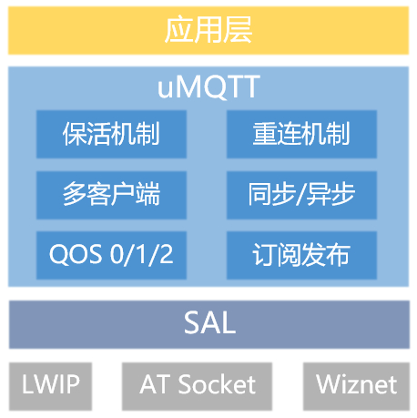

# uMQTT

## 1、介绍

uMQTT 软件包是 RT-Thread 自主研发的，基于 MQTT 3.1.1 协议的客户端实现，它提供了设备与 MQTT Broker 通讯的基本功能

uMQTT 软件包功能如下:  

* 实现基础的连接、订阅、发布功能;  
* 具备多重心跳保活，设备重连机制，保证 mqtt 在线状态，适应复杂情况; 
* 支持 QoS=0, QoS=1, QoS=2 三种发送信息质量;  
* 支持多客户端使用;
* 用户端接口简便，留有多种对外回调函数;
* 支持多种技术参数可配置，易上手，便于产品化开发；
* 功能强大，资源占用率低，支持功能可裁剪。

资源占用(测试环境 W60X ):

| ROM | RAM | 动态RAM | 
| :-: | :-: | :-: |
| 12.97KByte | 0.01KByte | 4.9KByte | 


### 1.1 目录结构

```
umqtt
├───docs                                // 说明文档
├───inc  
│   ├───umqtt_internal.h                // 内部打包及发送相关头文件
│   ├───umqtt_cfg.h                     // 结构体配置头文件
│   └───umqtt.h                         // 对外提供接口头文件
├───src
│   ├───pkgs                            // 完成对 paho_mbedded 软件库的功能裁剪移植
│   │   ├───umqtt_pkgs_decode.c         // 打包实现源文件
│   │   ├───umqtt_pkgs_encode.c         // 解包实现源文件
│   ├───trans                           
│   │   └───umqtt_trans.c               // 传输层相关源文件
│   └───umqtt_utils.c                   // 通用接口实现文件
├───samples                             // finsh 调试接口示例
├───tests                               // 测试用例
├───LICENSE                             // 软件包许可证
├───README.md                           // 软件包使用说明
└───SConscript                          // RT-Thread 默认的构建脚本
```

### 1.2 许可证
uMQTT 软件包遵循 Apache-2.0 许可，详见 LICENSE 文件。

### 1.3 依赖

- RT_Thread 3.0+
- SAL 层组件

## 2、获取软件包

**uMQTT 软件包相关配置选项介绍**
```
--- umqtt: A MQTT Client for RT-Thread
[ ]   Enable MQTT example
[ ]   Enable MQTT test
(4)   subtopic name list numbers
(1024) send buffer size
(1024) receive buffer size
(1000) uplink timer def cycle, uint:mSec
(5)   reconnect max count
(60)  reconnect time interval, uint:Sec
(5)   keepalive func, max count
(30)  heartbeat interval, uint:Sec
(4)   connect timeout, uint:Sec
(100) receive timeout, uint:mSec
(4)   send timeout, uint:Sec
(4096) receive thread stack size
(8)   thread priority
(4)   async message ack queue count
(0xFFFF) connect information, keepalive interval, uint:Sec
[ ]   Enable change connect keepalive time, uint:Sec
      Version (latest)  --->
```

* subtopic name list numbers: 内部允许最大同时订阅数量
* send buffer size: 发送数据缓存大小
* receive buffer size: 接收数据缓存大小
* uplink timer def cycle, uint:mSec: 定时器运行周期, 单位: mSec
* reconnect max count: 最大重连次数
* reconnect time interval, uint:Sec: 重连间隔时间, 单位: Sec
* keepalive func, max count: 保活机制中心跳重连次数
* heartbeat interval, uint:Sec: 心跳发送间隔, 单位: Sec
* connect timeout, uint:Sec: 连接超时时间, 单位: Sec
* receive timeout, uint:mSec: 接收超时时间, 单位: mSec
* send timeout, uint:Sec: 发送超时时间, 单位: Sec
* receive thread stack size: 内部接收线程堆栈
* thread priority: 内部线程优先级
* async message ack queue size: 接收线程处理完接收数据向外部传送处理结果消息队列大小
* connect information, keepalive interval, uint:Sec：MQTT 协议中 CONNECT 命令下 KEEPALIVE 值，默认最大 0xFF, 单位: Sec
* Enable change connect keepalive time, uint:Sec: 允许修改 MQTT 连接信息中的 keepalive 时间, 单位: Sec
* Version: 软件版本号 

## 3、使用 uMQTT 软件包

### 3.1 软件包工作原理

uMQTT 软件包主要用于在嵌入式设备上实现 MQTT 协议，软件包的主要工作基于 MQTT 协议实现。软件包分层图如下:

  

软件包实现过程中主要做了:

1. 根据 MQTT 3.1.1 协议规定，进行软件包数据协议的封包解包；

2. 传输层函数适配对接 SAL 层；

3. umqtt 客户端层，根据协议包层和传输层编写符合应用层的接口。实现基础连接、断连、订阅、取消订阅、发布消息等功能。支持 QoS0/1/2 三种发送信息质量。利用 uplink timer 定时器，实现多重心跳保活机制和设备重连机制，增加设备在线稳定性，适应复杂情况。

### 3.2 用户 API 介绍

#### 3.2.1 创建对象
```c
umqtt_client_t umqtt_create(const struct umqtt_info *info);
```
创建客户端结构体对象。

| 参数              | 描述                                |  
|:------------------|:-----------------------------------|  
| info | 用户信息配置 |  
| **返回值** | **描述** |  
| != RT_NULL | umqtt 客户端结构体指针 |  
| == RT_NULL | 创建失败 |  

#### 3.2.2 删除对象
```c
int umqtt_delete(struct umqtt_client *client);
```
删除客户端结构体对象，并释放内存。

| 参数 | 描述 |  
|:----|:----|  
| client | umqtt 客户端结构体指针 |  
| **返回值** | **描述** |  
| UMQTT_OK | 成功 |  

#### 3.2.3 启动客户端
```c
int umqtt_start(struct umqtt_client *client);
```
启动客户端会话，进行网络连接，和 MQTT 协议连接。

| 参数 | 描述 |  
|:----|:----|  
| client | umqtt 客户端结构体指针 |  
| **返回值** | **描述** |  
| >=0 | 成功 |  
| <0 | 失败 |  

#### 3.2.4 停止客户端
```c
void umqtt_stop(struct umqtt_client *client);
```
停止客户端会话，关闭接收线程，暂停 uplink 定时器，发送 MQTT 断开连接命令，关闭 socket 套接字。

| 参数 | 描述 |  
|:----|:----|  
| client | umqtt 客户端结构体指针 |  
| **返回值** | **描述** |  
| 无 | 无 |  

#### 3.2.5 发布消息
```c
int umqtt_publish(struct umqtt_client *client, enum umqtt_qos qos, const char *topic, void *payload, size_t length, int timeout);
```
针对订阅主题发布相关质量的消息。

| 参数 | 描述 |  
|:----|:----|  
| client | umqtt 客户端结构体指针 |  
| qos | 消息发送质量 |  
| topic | 发布主题 |  
| payload | 发布消息 |  
| length | 发布消息的长度 |  
| timeout | 发布消息超时时间, 单位:mSec |  
| **返回值** | **描述** |  
| >=0 | 成功 |  
| <0 | 失败 |  

#### 3.2.6 订阅主题
```c
int umqtt_subscribe(struct umqtt_client *client, const char *topic, enum umqtt_qos qos, umqtt_subscribe_cb callback);
```
订阅主题，并设置对应主题接收 publish 消息时的回调函数。

| 参数 | 描述 |  
|:----|:----|  
| client | umqtt 客户端结构体指针 |  
| topic | 订阅主题 |  
| qos | 订阅质量 |  
| callback | 对应主题接收 publish 消息时的回调函数 |  
| **返回值** | **描述** |  
| >=0 | 成功 |  
| <0 | 失败 |  

#### 3.2.7 取消订阅主题
```c
int umqtt_unsubscribe(struct umqtt_client *client, const char *topic);
```
取消相关主题的订阅，并释放相关的资源。

| 参数 | 描述 |  
|:----|:----|  
| client | umqtt 客户端结构体指针 |  
| topic | 取消订阅主题 |  
| **返回值** | **描述** |  
| >=0 | 成功 |  
| <0 | 失败 |  

#### 3.2.8 异步发送消息
```c
int umqtt_publish_async(struct umqtt_client *client, enum umqtt_qos qos, const char *topic, void *payload, size_t length);
```
异步发送消息，只负责将信息发送出去，不负责阻塞接收。

| 参数 | 描述 |  
|:----|:----|  
| client | umqtt 客户端结构体指针 |  
| qos | 发送消息质量 |  
| topic | 发送消息对应主题 |  
| payload | 发布的消息 |  
| length | 发布的消息长度 |  
| **返回值** | **描述** |  
| >=0 | 成功 |  
| <0 | 失败 |  

#### 3.2.9 设定获取参数
```c
int umqtt_control(struct umqtt_client *client, enum umqtt_cmd cmd, void *params);
```
根据相关命令设定或者读取内部相关参数。

| 参数 | 描述 |  
|:----|:----|  
| client | umqtt 客户端结构体指针 |  
| cmd | 设定或者读取内部相关参数 |  
| params | 设定数据时，为返回值结构体；读取数据时，为 RT_NULL |  
| **返回值** | **描述** |  
| >=0 | 设定数据时, 成功; 读取数据时, 为具体返回数据 |  
| >0 | 设定数据时, 失败; 读取数据时, 为具体返回数据 |  

### 3.3 示例介绍

#### 3.3.1 准备工作

- menuconfig 配置获取软件包和示例代码

    打开 RT-Thread 提供的 ENV 工具，使用 **menuconfig** 配置软件包, 
    启用 UMQTT 软件包，并配置使能测试例程 (`Enable MQTT example`), 如下所示: 

``` shell
RT-Thread online packages
    IoT - internet of things  --->
        [*] umqtt: A MQTT Client for RT-Thread.  --->
            [*] Enable MQTT example                     # 开启 UMQTT 例程
```

- 使用 `pkgs --update` 命令下载软件包;  
- 编译下载;  
- 使用 [emqx](https://www.emqx.io/cn/) 搭建 MQTT Broker 。 

#### 3.3.2 启动例程

* 启动 umqtt 客户端

启动 umqtt 客户端流程:
- 申明 `struct umqtt_info` 结构体变量作为 umqtt 客户端用户配置变量  
- 测试 MQTT Broker 的 URI 进行赋值  
- 创建 umqtt 客户端  
- 声明并设置连接、在线、离线、心跳回调函数
- 调用 `umqtt_start()` 函数，启动 umqtt 客户端

```shell
msh />umqtt_ex_start
[D/umqtt.sample]  umqtt example start!
[I/umqtt]  connect success!
[I/umqtt.sample]  umqtt start success!
```

* 订阅功能

```shell
msh />umqtt_ex_subscribe "test0"
[D/umqtt.sample]  umqtt example subscribe!
[D/umqtt]  start assign datas !
[D/umqtt] subscribe ack ok!
```

* 发布消息

```shell
msh />umqtt_ex_publish test 0 hello                     # 消息发送质量 qos0
[D/umqtt.sample]  umqtt example publish!
[D/umqtt.sample]  umqtt topic recv callback! name length: 4, name: testhello, packet id: 0, payload len: 6

msh />umqtt_ex_publish test 1 hello_this                # 消息发送质量 qos1 
[D/umqtt.sample]  umqtt example publish!
[D/umqtt.sample]  umqtt topic recv callback! name length: 4, name: test, packet id: 1, payload len: 11
[I/umqtt]  publish qos1 ack success!

msh />umqtt_ex_publish test 1 hello_this_world          # 消息发送质量 qos2 
[D/umqtt.sample]  umqtt example publish!
[D/umqtt.sample]  umqtt topic recv callback! name length: 4, name: test, packet id: 2, payload len: 17
[I/umqtt]  publish qos2 ack success!

```

* 取消订阅

```shell
msh />umqtt_ex_unsubscribe test
[D/umqtt.sample]  umqtt example unsubscribe!
[I/umqtt]  unsubscribe ack ok!
```

* 停止 umqtt 客户端

```shell
msh />umqtt_ex_stop
[D/umqtt.sample]  umqtt example stop!
```

## 4、注意事项

* 本版本暂不支持加密通信协议; 
* 使用 [emqx](https://www.emqx.io/cn/) 搭建 MQTT Broker 。


## 5、联系方式 & 感谢
联系人: springcity  
Email: caochunchen@rt-thread.com


